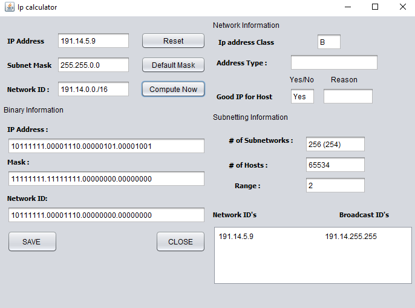

# AN IP CALCULATOR IN JAVA 
AN IP CALCULATOR IN JAVA 
Following figure shows the output  from  java program. The application  take input as any IP address and print the information such as its class, mask, block, subnets etc as shown in fig. 

